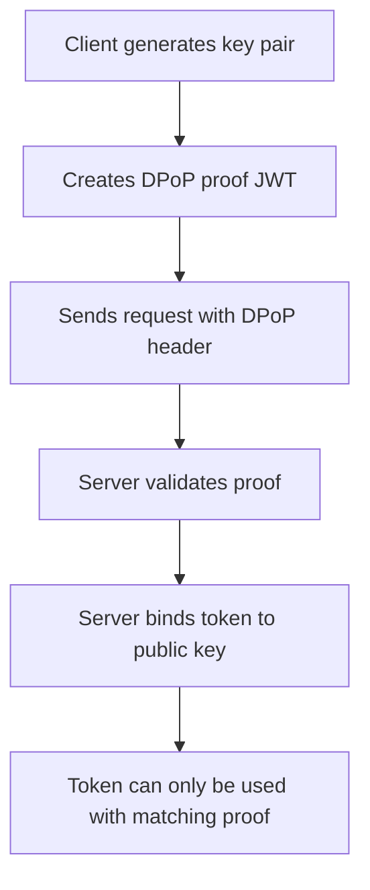
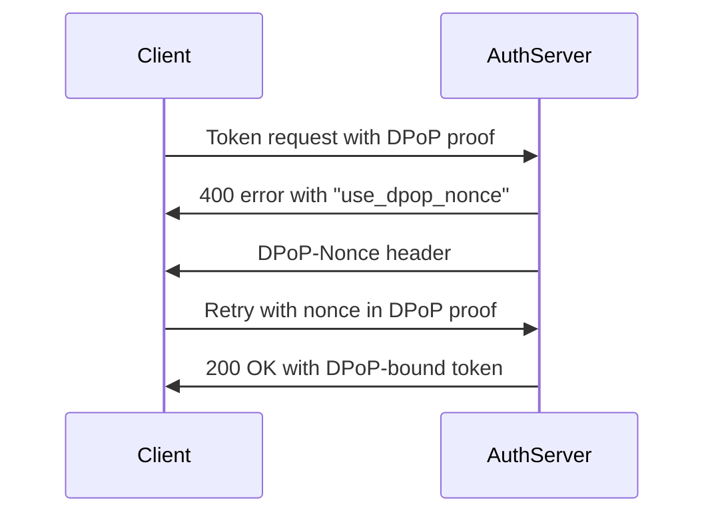

# DPoP (Demonstration of Proof-of-Possession) Explained

Based on the code in your MCP server, I can see DPoP being implemented in the [`exchange_token()`](mcp_server.py:151-225) function. Let me explain what DPoP is and how it works in your implementation.

## What is DPoP?

**DPoP (Demonstration of Proof-of-Possession)** is an OAuth 2.0 security extension defined in RFC 9449 that provides cryptographic proof that a client possesses a particular private key. It's designed to prevent token theft and replay attacks by binding access tokens to a specific client's cryptographic key.

## Key Concepts



### 1. **Proof-of-Possession**
Unlike traditional bearer tokens that can be used by anyone who possesses them, DPoP-bound tokens require the client to prove they own the private key associated with the token.

### 2. **Key Binding**
The access token becomes cryptographically bound to the client's public key, making it useless to attackers who intercept it.

## How DPoP Works in Your Code

### Step 1: Key Generation
```python
# Generate DPoP key pair (lines 169-171)
private_key = rsa.generate_private_key(
    public_exponent=65537, 
    key_size=2048, 
    backend=default_backend()
)
```

### Step 2: JWK Creation
```python
# Create JSON Web Key from public key (lines 176-180)
jwk = {
    "kty": "RSA",
    "n": urlsafe_b64encode_no_padding(public_numbers.n.to_bytes(...)),
    "e": urlsafe_b64encode_no_padding(public_numbers.e.to_bytes(...)),
}
```

### Step 3: DPoP Proof JWT Creation
```python
# Create DPoP proof (lines 182-196)
def create_dpop_proof(nonce: str | None = None) -> str:
    dpop_header = {
        "typ": "dpop+jwt",      # Indicates this is a DPoP proof
        "alg": ALGORITHMS.RS256, # Signing algorithm
        "jwk": jwk,             # Public key for verification
    }
    dpop_claims = {
        "jti": os.urandom(16).hex(), # Unique identifier
        "htm": "POST",               # HTTP method
        "htu": token_url,            # HTTP URI
        "iat": int(time.time()),     # Issued at timestamp
    }
    if nonce:
        dpop_claims["nonce"] = nonce # Server-provided nonce
    
    return jwt.encode(dpop_claims, private_key, algorithm=ALGORITHMS.RS256, headers=dpop_header)
```

### Step 4: Token Exchange with DPoP
```python
# Include DPoP proof in request (line 198)
headers = {"DPoP": create_dpop_proof()}

# Handle nonce challenge (lines 211-216)
if response.status_code == 400 and response.json().get("error") == "use_dpop_nonce":
    nonce = response.headers.get("DPoP-Nonce")
    headers["DPoP"] = create_dpop_proof(nonce)
    # Retry with nonce
```

## DPoP JWT Structure

The DPoP proof JWT contains:

**Header:**
- `typ`: "dpop+jwt"
- `alg`: Signing algorithm (RS256)
- `jwk`: Public key in JWK format

**Claims:**
- `jti`: Unique token ID (prevents replay)
- `htm`: HTTP method being used
- `htu`: Target URL
- `iat`: Timestamp when proof was created
- `nonce`: Optional server-provided nonce

## Security Benefits

### 1. **Replay Attack Prevention**
- Each DPoP proof contains a unique `jti` and timestamp
- Servers can reject old or duplicate proofs

### 2. **Token Binding**
- Access tokens are cryptographically bound to the client's public key
- Stolen tokens cannot be used without the corresponding private key

### 3. **Man-in-the-Middle Protection**
- HTTP method (`htm`) and URI (`htu`) are included in the proof
- Prevents attackers from using proofs for different endpoints

## DPoP Nonce Challenge Flow



Your implementation handles this nonce challenge correctly on lines 211-216:

```python
if response.status_code == 400 and response.json().get("error") == "use_dpop_nonce":
    nonce = response.headers.get("DPoP-Nonce")
    if not nonce:
        raise Exception("DPoP nonce not found in response")
    headers["DPoP"] = create_dpop_proof(nonce)
    response = requests.post(token_url, headers=headers, data=data, auth=(client_id, client_secret))
```

## Use Case in Your MCP Server

In your implementation, DPoP is used during **token exchange** (OAuth 2.0 Token Exchange - RFC 8693) where:

1. Your MCP server receives an access token from a client
2. It needs to exchange this token for a different token to access a third-party API
3. DPoP ensures the exchanged token is bound to your server's key
4. This prevents token misuse if the exchanged token is intercepted

## Benefits Over Bearer Tokens

| Bearer Tokens | DPoP Tokens |
|---------------|-------------|
| "Anyone with token can use it" | "Must prove key ownership" |
| Vulnerable to replay attacks | Protected by unique proofs |
| No binding to client | Cryptographically bound |
| Simple but less secure | More complex but highly secure |

DPoP significantly enhances security by ensuring that even if tokens are intercepted, they cannot be used without the corresponding private key that only the legitimate client possesses.

## FAQ

Is dpop Mandatory for token exchange?

**No, OAuth token exchange does NOT require DPoP.** They are separate, independent specifications:

## OAuth 2.0 Token Exchange (RFC 8693)
- **Standalone specification** for exchanging one token for another
- Works perfectly fine **without DPoP**
- Basic token exchange only requires the standard parameters:
  ```
  grant_type=urn:ietf:params:oauth:grant-type:token-exchange
  subject_token=<original_token>
  subject_token_type=urn:ietf:params:oauth:token-type:access_token
  ```

## DPoP (RFC 9449) 
- **Optional security enhancement** that can be applied to various OAuth flows
- Can be used with token exchange, authorization code flow, client credentials, etc.
- When used, it binds tokens to cryptographic keys

## In Your Implementation

Your MCP server **chooses** to use DPoP with token exchange for **enhanced security**, but this is optional. You could remove the DPoP parts and still have working token exchange:

```python
# Without DPoP - still valid token exchange
data = {
    "grant_type": "urn:ietf:params:oauth:grant-type:token-exchange",
    "subject_token": access_token,
    "subject_token_type": "urn:ietf:params:oauth:token-type:access_token",
    # ... other params
}
response = requests.post(token_url, data=data, auth=(client_id, client_secret))
```

## When DPoP is Used With Token Exchange

**Optional scenarios:**
- Enhanced security for high-value tokens
- Preventing token theft in untrusted environments  
- Compliance requirements
- Third-party APIs that support/prefer DPoP-bound tokens

**Required scenarios:**
- When the authorization server specifically requires DPoP for token exchange
- When the target resource server only accepts DPoP-bound tokens

Your implementation uses DPoP as a **security best practice**, not because token exchange mandates it.